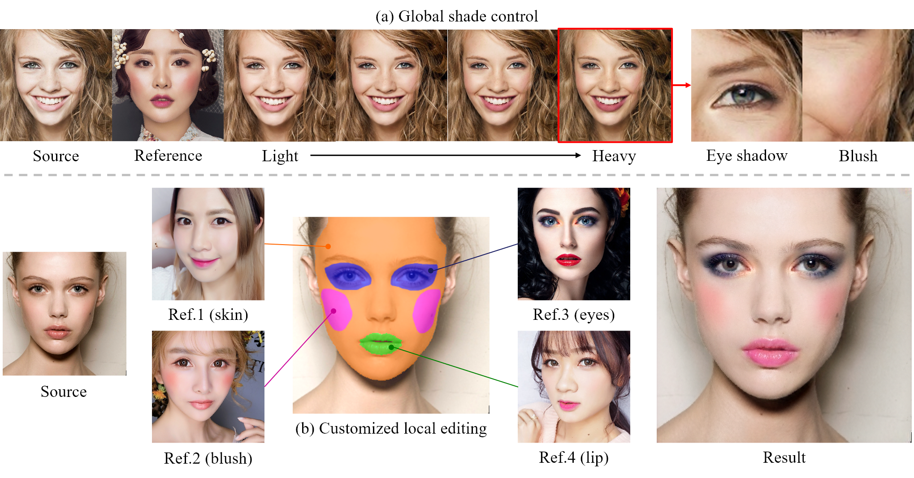

# EleGANt: Exquisite and Locally Editable GAN for Makeup Transfer

[![CC BY-NC-SA 4.0][cc-by-nc-sa-shield]][cc-by-nc-sa]

Official [PyTorch](https://pytorch.org/) implementation of ECCV 2022 paper "[EleGANt: Exquisite and Locally Editable GAN for Makeup Transfer](https://arxiv.org/abs/2207.09840)"

*Chenyu Yang, Wanrong He, Yingqing Xu, and Yang Gao*.



## Getting Started

- [Installation](assets/docs/install.md)
- [Prepare Dataset & Checkpoints](assets/docs/prepare.md)

## Test

To test our model, download the [weights](https://drive.google.com/drive/folders/1xzIS3Dfmsssxkk9OhhAS4svrZSPfQYRe?usp=sharing) of the trained model and run

```bash
python scripts/demo.py
```

Examples of makeup transfer results can be seen [here](assets/images/examples/).

## Train

To train a model from scratch, run

```bash
python scripts/train.py
```

## Customized Transfer

https://user-images.githubusercontent.com/61506577/180593092-ccadddff-76be-4b7b-921e-0d3b4cc27d9b.mp4

This is our demo of customized makeup editing. The interactive system is built upon [Streamlit](https://github.com/streamlit/streamlit) and the interface in `./training/inference.py`.

**Controllable makeup transfer.**


**Local makeup editing.**


## Citation

If this work is helpful for your research, please consider citing the following BibTeX entry.

```text
@article{yang2022elegant,
  title={EleGANt: Exquisite and Locally Editable GAN for Makeup Transfer},
  author={Yang, Chenyu and He, Wanrong and Xu, Yingqing and Gao, Yang}
  journal={arXiv preprint arXiv:2207.09840},
  year={2022}
}
```

## Acknowledgement

Some of the codes are build upon [PSGAN](https://github.com/wtjiang98/PSGAN) and [aster.Pytorch](https://github.com/ayumiymk/aster.pytorch).

## License

This work is licensed under a
[Creative Commons Attribution-NonCommercial-ShareAlike 4.0 International License][cc-by-nc-sa].

[![CC BY-NC-SA 4.0][cc-by-nc-sa-image]][cc-by-nc-sa]

[cc-by-nc-sa]: http://creativecommons.org/licenses/by-nc-sa/4.0/
[cc-by-nc-sa-image]: https://licensebuttons.net/l/by-nc-sa/4.0/88x31.png
[cc-by-nc-sa-shield]: https://img.shields.io/badge/License-CC%20BY--NC--SA%204.0-lightgrey.svg
